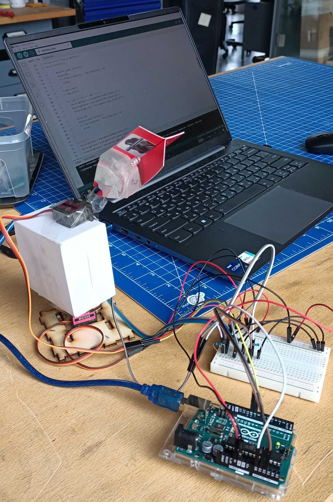

# Embedded systems projects

## Description

Below is a group of several projects based on Arduino board and ESP8266.

### Blinking LEDs

Build a circuit with a red, yellow and green LEDs. Red and yellow should blink
interchangeably. With a press to a switch, green should turn on and the previous
LEDs will turn off.

Second part does similar, but this time red and yellow LEDs blink interchangeably.

Third part includes red LED additional blinking.

### LCD screen

First part of the project consists of a LCD screen and potentiometer. With the
help of the latter, LCD should display voltage value which is being regulated
via potentiometer.

Second part makes possible to enter voltage value via serial connection (console)
instead of using potentiometer.

### Light-sensitive tracking device

Goal of this project is to make a light tracking device. Device will detect the
light source and turn towards it. It uses two servos and three photoresistors so
it can rotate and follow all directions.

Prototype
 

### Remote control of LED-matrix via webserver/ESP8266 

First part: Create and host a webpage on ESP8266 which enables to turn on / off
LEDs with provided browser's interface.

Second part: write few color sequences to run on LED matrix using browser's
interface.
