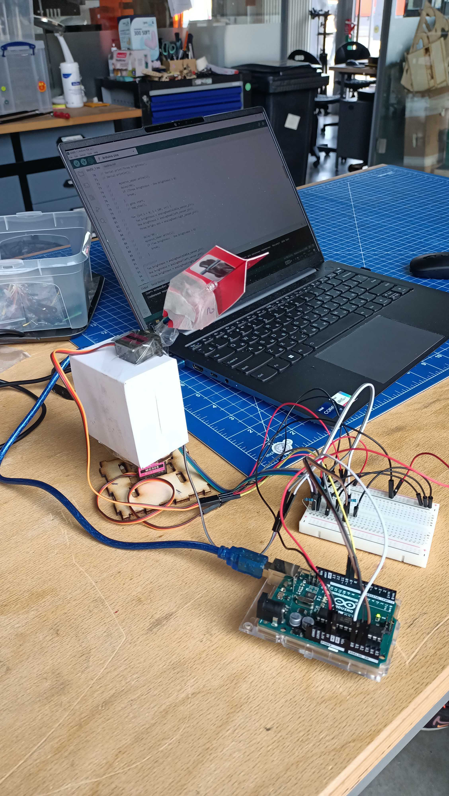

# Arduino mini-projects

Below is a short and concise description of projects based on Arduino board and ESP8266

## First project: blinking LEDs

Build a circuit with a red, yellow and green LEDs. Red and yellow should blink interchangeably. With a press to a switch, green should turn on and the previous LEDs will turn off.

Second part does similar, but this time red and yellow LEDs blink interchangeably.

Third part includes red LED additional blinking.

## Second project: LCD screen

First part of the project consists of a LCD screen and potentiometer. With the help of the latter, LCD should display voltage value which is being regulated via potentiometer.

Second part makes possible to enter voltage value via serial connection (console) instead of using potentiometer.

## Third project: light-sensitive tracking device

Task of this project is to make/improvise a light tracking device by using two servos and three photoresistors. Device should with the help of photoresistors detect the source of light and turn towards it.

## Fourth project: remote control of ESP8266 via webserver

First part: Create and host a webpage on ESP8266 which enables to turn on / off LEDs with provided browser's interface.

Second part: write few color sequences to run on LED matrix using browser's interface.
